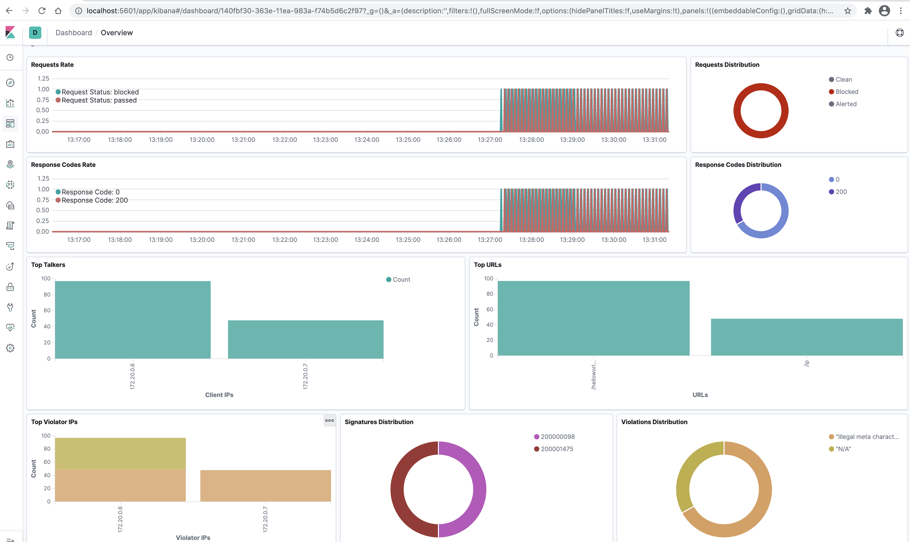
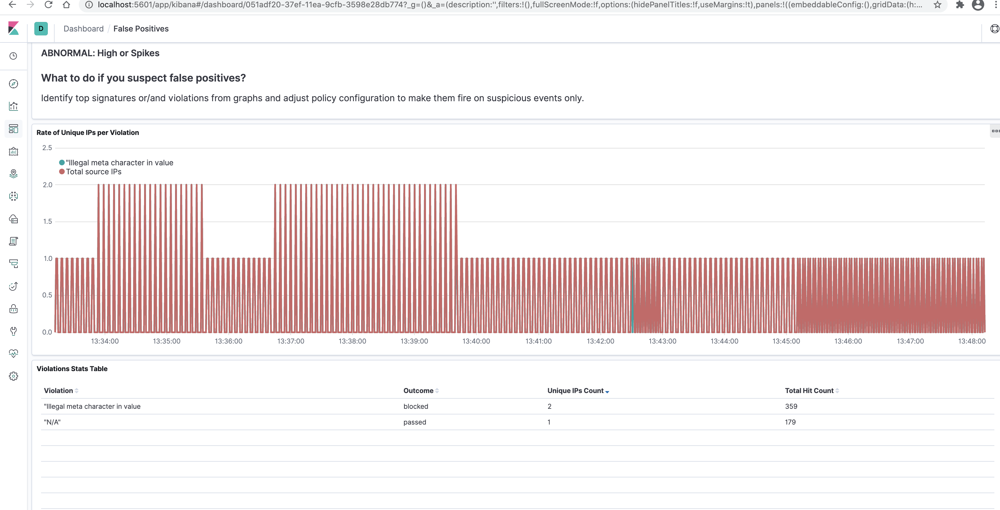

# NGINX App Protect ELK Demo

> ** Note reference to the dashboards https://github.com/464d41/f5-waf-elk-dashboards and NAP demo

## After clone the repo:
- Change to appprotect directory

```

cd approtect

```

- Build App Protect image (should take 5mins depending on your Internet speeds)

```

docker build -f ./DockerfileAppProtectWithAttackSig -t nap:20 .

```

- Build rest of components and run

```

docker-compose build && docker-compose up -d

```

## Open the Kibana dashboard
- open url localhost:5601, then choose the overview, and will see as below:


- False Positive dashboard

